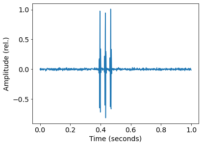
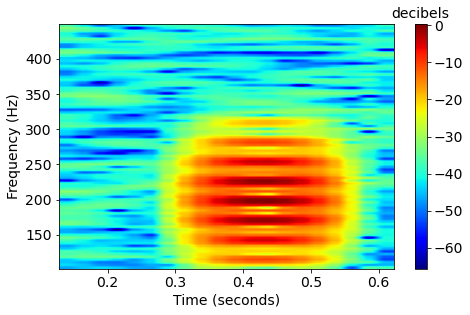

# Overview
A deep embedded clustering algorithm was developed to separate fish calls and whale song from coral reef ambient noise using the spectrogram representations.


 
$\xrightarrow[\text{world}]{\text{hello}}$ 

E. Ozanich, A. Thode, P. Gerstoft, L. A. Freeman, and S. Freeman, “Deep embedded clustering of coral reef bioacoustics,”
_*J. Acoust. Soc. Am. 149*_ (2021): 2587–2601

```ruby
My code here
```

